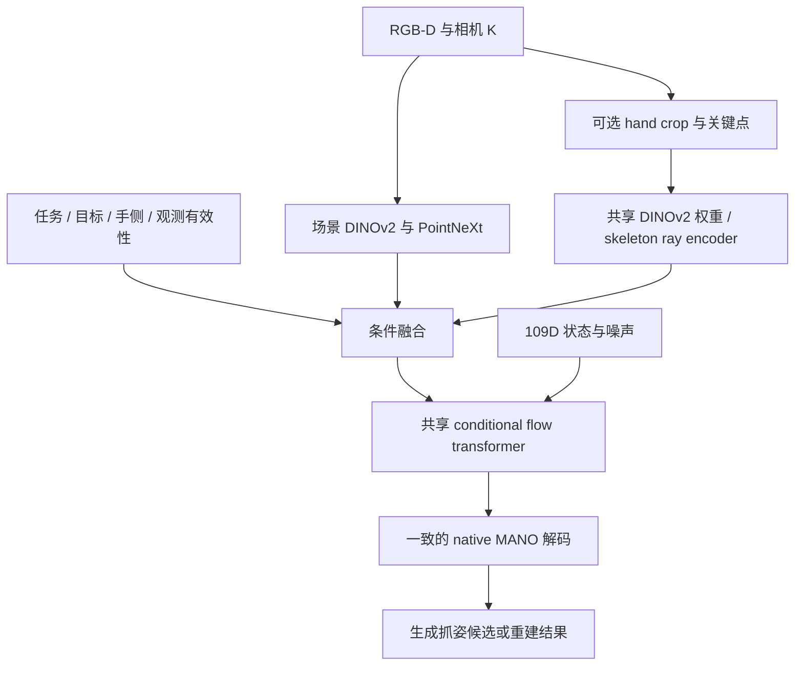

# RGB-D 手部抓取生成与重建统一模型设计

日期：2026-09-18。状态：推荐设计，尚未实施；不代表已有性能结论。

## 1. 推荐方案与范围

采用一个显式任务条件化的 RGB-D conditional flow matching 模型，共享 DINOv2 + LoRA、PointNeXt、融合模块和 MANO flow decoder。物体目标、局部手部图像、关键点、置信度组成可选择的条件集合。生成与重建均对完整 109D 状态训练与采样，包括 10D shape。首版针对单帧，不引入 SLAM 或时序模块。

统一的是参数空间、概率建模、主要权重和训练框架；输入观测及已知变量可以随任务不同。检测器和 RTMPose 是可选观测提供者，不是任务判别器。

| 方案 | 判断 |
| --- | --- |
| 显式任务条件 + 共享 flow + 可缺失观测 | 推荐；意图可控，保留生成多样性与重建观测约束，便于公平评估共享收益 |
| 无任务条件，仅由 hand detector 或 skeleton 是否存在推断任务 | 不作为默认；检测失败、遮挡和用户意图无法区分，容易学到数据集捷径 |
| 共享 encoder，但生成/重建使用两个完整 decoder | 留作消融；可以减轻负迁移，但共享手部先验较弱且参数更多 |

数学上分别学习 p(H | S, Q_object, task=GEN) 与 p(H | S, Q_hand, O_hand, task=REC)。H 包括 pose、placement 和 shape；S 为 RGB-D 场景，Q 为带类型的目标，O_hand 为可能缺失的手部观测。两者由同一个条件速度场实现。

## 2. 模型如何知道做什么

### 2.1 任务意图、目标、观测可靠性是三个独立变量

- `task_id`：GEN 或 REC，由调用者/上游任务系统指定；训练时由样本的监督任务赋值。
- `target`：GEN 的物体点击、框或 mask；REC 的手实例 ID、框或人工指定 ROI。多个物体/手时必须明确选哪一个。
- `observation_valid/confidence`：当前手部 crop、关键点、深度等观测是否可用、可信。

同一张手握杯子的图像既可以要求恢复当前手，也可以要求生成杯子的另一种抓姿。图像本身不能唯一确定使用者意图。无任务条件时，模型可能学习 p(H | I) 中两种语义的混合分布。

| 请求 | 条件处理 | 输出语义 |
| --- | --- | --- |
| 无手图像，GEN，选择物体 | 物体 query 有效；hand observation 为 NULL | 目标物体的可行抓姿候选 |
| 可见手，REC，选择手实例 | hand crop 与可靠关键点可用 | 图像中该手的当前姿态/手形 |
| 有手但 RTMPose 失败，REC | 保留 RGB-D；关键点缺失；task_id 仍为 REC | 根据剩余证据恢复，并标明观测缺失 |
| 手严重遮挡，REC | 可靠性下降；可返回不确定候选或失败状态 | 仍是指定手的恢复，不自动变为抓取生成 |
| 可见手，GEN，选择物体 | 不把现有手的骨架作为目标抓姿约束 | 对该物体生成新抓姿；需要覆盖此场景的训练数据 |
| 请求同时输出两者 | 复用场景特征，分别使用 GEN/REC 条件采样 | 两个有明确任务标签的结果集合 |

无手、无目标、也无其他约束时，不能声称从单帧 RGB-D 恢复了一个真实存在的隐藏手。先验样本与观测恢复应在输出中区分。

### 2.2 自动模式的定位

正式训练与评测使用显式模式。产品可提供 `auto`，但它是有预设语义的策略层：用户选择对象时偏向 GEN；选择手实例时偏向 REC；没有提示而且任务歧义时返回候选任务或要求选择。

只有在产品明确定义“可靠检测到目标手则恢复，否则对已选物体生成”时，才能直接采用这条自动规则。它无法从图像读出任意用户意图。不得训练一个有手/无手二分类器，然后把分类准确率当成通用任务理解能力。

### 2.3 任务信号如何进入网络

将 task embedding 与 flow time embedding 组合后输入各层 AdaLN；同时给条件 token 加 task/type embedding。任务应进入速度场所有层，不能只存在于 YAML 或控制预处理的 Python 分支中。

query 单独携带 `query_type`、坐标、有效性和置信度。物体点击和掌心 anchor 即使都是 (u,v,d)，物理含义也不同。当前 `point_uv` 不应继续隐式承担两种语义。

### 2.4 谁调用 detector / RTMPose，混合 batch 如何构造

前端由确定性的逐样本任务标记控制，而不是让 flow 学一个门控器去调用外部工具。训练数据 adapter 把 HUG 生成样本标为 GEN、DexYCB/HO3D 重建样本标为 REC；推理 API 从用户请求或上游任务获得同一个 task_id。网络内部的 task embedding 用来解释条件，不能代替执行预处理的程序逻辑。

```python
scene_inputs = preprocess_rgbd(sample)
if sample.task_id == REC:
    # 有原图坐标缓存时读取；没有时才在前端推理服务计算。
    hand_obs = load_cached_or_detect(sample.rgb_original)
    # detector 给 bbox，RTMPose 给 2D points/confidence。
    # 坐标先按当前实际生效的增强同步，再从增强原图裁取局部图像。
    hand_crop, crop_K, skeleton = make_hand_observations(hand_obs)
else:
    hand_crop, crop_K, skeleton = None, None, None
```

混合 batch 例如 `[GEN, REC, GEN, REC]`：所有 4 个样本都编码场景；只把两个 REC 的有效 hand crops 组成局部子批次送入共享 DINOv2，再把局部 tokens 放回各自样本的位置。GEN 使用缺失观测 token，额外 padding 使用 attention mask，统一送入同一个 flow。任务信号、缺失状态与 detector confidence 各司其职。DDP 实施时需保证全 GEN rank 也不会使局部专用可训练参数被意外判定为未使用；可在各 rank 采用固定混合配额并正确处理缺失 token 分支。

缓存 detector/RTMPose 的框和坐标即可；LoRA 学习使用当前增强后的图像在线编码，不能复用旧 DINO features。高分辨率 crop 指从原始高分辨率图裁出手区域再 resize 为 encoder 输入（首版 224x224），使手占更多 pixels；不必将整个原图以高分辨率送进 ViT。手框可靠但关节失败时保留 crop，只将 skeleton 标缺失；手框也失败时保留 scene 和 REC task，可使用请求提供的 ROI，否则局部观测缺失。

## 3. 共享主干与观测组织



### 3.1 场景通路始终存在

场景 RGB 编码保留物体、接触区域和周围空间；depth 通过 K 反投影成米制点云，由 PointNeXt 编码。GEN 使用目标物体点击附近的点云，先保留 HUG 的 0.30m 起始半径。REC 使用手及邻近交互区域；不要只保留骨架附近极窄区域而删掉物体表面。

GEN 的 RGB 视野先保留 HUG 发布数据的场景 crop。REC 额外从原始分辨率图像产生 hand crop；场景图和手部图通过同一套 DINOv2 + LoRA 权重编码，但带不同 view embedding。两次图像前向增加算力，不能宣称局部通路免费。首版可压缩场景 tokens，保留较密的 hand patches，具体数量通过显存和精度实测确定。

HUG 发布图像为 224x224，不能通过上采样制造不存在的细节；DexYCB/HO3D 的局部 crop 应尽量来自原始图像。每个视野使用自己的变换矩阵和 K，点云继续统一在相机米制坐标系。左右镜像时必须同时维护图像、K、pose、native basis 和逆变换。

### 3.2 融合保留米制几何和独立 RGB 证据

推荐将 RGB 特征按 K 投影采样到 depth centroid，得到 point-painted geometry tokens，同时保留独立 RGB patches。这样既有 HUG 的显式 RGB/3D 对齐，也不会因为深度缺失而丢掉全部手部 RGB 信息。

这比现有纯 RGB/Depth token 拼接多一个几何融合步骤，属于需要消融验证的设计推断。实施时先保留现有并行 tokens 跑通统一训练，再单独对比加入 painting 的版本，不能将 HUG 的论文收益直接声称为本项目收益。

物体 query 既影响点云/ROI 的选择，也作为条件输入 flow。若使用 query attention，让目标 query 对多个 scene tokens 做选择，并可加入 query-relative XYZ。当前 `legacy_broadcast` 中单个 K/V 的 attention 权重恒为 1，这不等于整个网络不依赖 query，但不足以充当空间选择机制。

### 3.3 手部观测可缺失

WiLoR detector 提供 hand ROI；RTMPose 提供每关节 2D 观测及 confidence。用 K 将坐标转为相机射线，不用任意像素坐标代替米制几何。它们仅补充条件，GEN 无需检测到手才能工作。

对每类观测使用 `c_obs = w * E(obs) + (1-w) * c_missing`。另外保留明确状态标记：任务不使用、检测失败、训练主动丢弃。避免将全零坐标误解为一个位于图像原点的手；完全缺失时也不能让 attention 对全无效 key 产生 NaN。

REC 的关键点低置信度不应自动把整幅 RGB 证据一起关掉；crop 的质量与关键点的质量分别建模。训练随机去掉部分或全部关键点、扰动观测并保留 REC task，让模型学会根据图像和深度继续重建。仅对骨架做 masking 不等于去掉了 RGB 中的手。

HandFlow 的约 20% 随机帧 masking 用于视频；单帧不能照搬为 20% 完全无视觉证据。首轮可用约 10%-20% skeleton 整组缺失作候选设置，先通过重建验证决定比例，场景通路保持有效。

### 3.4 编码器与 decoder 的起点

首版采用已实现的 DINOv2-base + LoRA（第 8-11 层 Q/V，r=8），两任务共同优化同一 adapter。保留 PointNeXt 和当前 2 层 joint-attention + 4 层 DiT，先验证统一训练。不要同时更换到 DINOv3、扩成 HandFlow 的 24 层、改 flow 路径和改任务输入。

若混训显示共享 LoRA 明显损伤场景编码，再消融小型 view/task adapters；只有测到负迁移才增加独立参数。重建 gains 不保证提升 grasp SR，必须同时验证。

## 4. 统一 109D 状态与手形处理（按用户要求修订）

状态保持 `x = [translation(3), wrist6d(6), fingers6d(90), beta(10)]`。GEN 与 REC 都对完整 109D 加噪、计算 velocity loss、采样；共享四组投影和 flow blocks。不再将生成任务默认限制为固定 beta，也不采用先前建议的生成 beta known-state mask。

沿用仓库 t=0 为数据、t=1 为噪声：`x_t = (1-t) * normalize(x_data) + t * epsilon`，其中 epsilon 为 109D。输出速度也为 109D。

GEN 学习 pose 与 shape 的联合条件分布，生成完整抓姿和手形；REC 根据可见手估计 pose 与 shape。无手图像不能唯一识别未来抓取者的 shape，不妨碍模型对合理 shape 和相应 pose 联合采样。不能把生成的 shape 当成从无手图像测量到的某个真实人的手形，也不能在生成 pose 后任意替换 beta 并宣称接触有效。

数据需要提供与该 pose、translation、MANO basis 和 joints/mesh 配套的真实 shape。用户指出 HUG 开源数据存在真实 shape；上一版只检查单个本地 PKL，不能据此概括全部开源产物。当前实际训练目录与原始/不同版本发布产物必须区分，接入时明确真实 shape 的路径与记录映射，不能看到名为 `shape` 的字段就认定其保留原始被试差异。若某批 canonicalized PKL 丢失真实 shape，应从原始拟合标注恢复并检查几何一致性；只重命名字段或拿其他数据集 beta 替换不能恢复。

统一状态维度不代表左右手 shape basis 相同。继续用 native MANO_LEFT/RIGHT，不将 native 左手 beta 直接送进 MANO_RIGHT。手侧/basis ID 作为表示条件和解码元数据；这相对于当前只在 decoder 用 side 的实现，是需单独验证的扩展。部署时必须来自 detector、明确选择或相应估计，GT side 只能用于注明的 oracle 评估。GEN 首版固定右手；左手生成没有直接的 HUG 左手监督，不应默认声称支持。

首轮保持相机坐标系和现有 6D rotation 定义，混合训练统计只由训练集计算并固定到 checkpoint。若后来改成目标相对平移，需要重新计算统计并给出精确可逆变换，不能沿用原绝对平移 stats。

## 5. 数据、损失和训练协议

### 5.1 统一样本接口

每条样本明确携带 `task_id, rgb_scene, depth, K_scene, target_type, target_coords, target_valid, hand_obs, hand_obs_valid, hand_side, gt_params_109d, gt_joints, gt_vertices, supervision_masks`。深度无效值也要有 mask。监督缺失 mask 不等于把 beta 固定为已知条件。

这些字段由 dataset adapter 按样本生成；不能只用一个全局 `hand_crop.enabled`、`keypoint_source` 或 `use_query_condition` 控制混合 batch。先兼容旧 PKL 和 native overlay，通过在线 adapter 补字段，通常无需重写几十万 PKL。

HUG：GEN + 物体 mask 内采样 query + 与 pose/mesh 配套的真实 shape 标签。实际数据版本及该标签来源需核验。其 PKL 内手关节和 mesh 是目标监督，即使投影到图像中有坐标也不是可见观测，不得输入 skeleton 或据此生成 hand crop。

DexYCB/HO3D：REC + 部署条件相符的 detector/RTMPose 观测 + native/官方 GT。GT joints 可用于 loss；GT joints 作为模型条件的实验仍为 oracle。已知的 GT/GT 5.613 与 GT/RTMPose 7.35 必须分列，不能用前者作部署基线。

HO3D 没有公开训练标签的测试/evaluation 样本不能进入训练。每数据源使用自己的 supervision mask；不允许把一个数据源缺失的 mesh/params 以零值当标签。

### 5.2 混合采样

建议先从 GEN:REC = 1:1 的有效样本/损失权重开始；REC 内对 DexYCB 与 HO3D 均衡采样，形成大致 1M-HUG:DexYCB:HO3D = 2:1:1 的起点。比例是待验证超参，不是论文结论。各任务分别求均值，再加权合并；不能由原始帧数决定梯度贡献。

HUG 相邻帧往往来自同一物理抓取，约 1M 帧不是 1M 个独立抓姿。按 recording/object 分割并降低相邻重复帧集中采样；DexYCB/HO3D 按既定官方/序列协议划分。不同任务使用相同优化修复与训练预算，记录各数据集有效曝光次数。

### 5.3 损失

共享核心：归一化 MANO 速度 MSE + 时间加权相机系 3D joint loss。REC 可沿用经验证的 mesh loss，并单独消融由 GT 监督的 2D projection 和 shape loss。GEN 首轮保留 HUG 的 velocity/joint 目标，不强行跟随 REC 的全部 loss 权重。

REC 包含张手、接近物体以及并未形成抓取的姿态，不能因为共享了 HUG prior 就对所有 REC 样本强制接触物体。抓取可行性约束由任务和标签决定；共享解剖结构先验不等于所有输出都应是抓姿。

`L_total = lambda_GEN * mean(L_GEN) + lambda_REC * mean(L_REC)`

GEN 对配对抓姿做 flow matching/辅助 3D 监督并不等于强迫所有采样匹配该抓姿；不能对所有生成候选施加“复制唯一已记录抓姿”的确定性输出约束。可行抓姿多模态，评估应同时看质量和多样性。

单视角 RGB-D 只有部分表面，不能将到观测点云的距离当作完整物体 SDF。接触/碰撞 loss 只在可靠 mesh/SDF 或明确表面语义可用时增加；初版重点保留 HUG 已验证的几何监督和模拟评估。

注意 HUG/当前代码与 HandFlow 的 t 方向相反。沿用当前 t=1 噪声、t=0 数据及对应 (1-t) 几何权重，不能直接抄 HandFlow 的 t 权重。

### 5.4 分阶段训练

1. 先建立使用修复后优化器的单任务生成基线和单任务重建部署基线；v31/v32 GT 配置另列 oracle。
2. 从 HUG checkpoint 初始化兼容的共享部分，新建 task/type embedding、109D shape 和缺失条件。先冻结 RGB backbone，混训新条件接口和 flow，检查两任务均可工作。
3. 开启共享 LoRA 并继续两任务混训；以 1e-4 主干、5e-5 LoRA 作为已有实现的起点，不把该数值当成已验证最优。
4. 按单一变量增加 painting、观测噪声/缺失策略或 decoder 容量。

数据集与任务存在强关联：HUG 无手且为 GEN，DexYCB/HO3D 有手且为 REC。task token 本身不能消除捷径。REC 需有关键点缺失/局部遮挡样本；GEN 需逐步加入场景中有无关手但目标物体保持可见的合法样本，并检验任务 token 是否真的控制输出。

单纯删掉 DexYCB 的 skeleton 仍保留 RGB/Depth 中的真实手，不是无手生成样本。若要把交互数据用于 GEN，应利用对象 mesh/姿态或配准的无手观测构造物体证据，遮去手时同步处理 RGB、Depth、有效性和坐标；未知物体背面保持未知。此类桥接数据是扩展能力所需，先作为独立实验验证，不是首版加载所有数据的前提。

## 6. 验证统一架构是否成功

- 重建：官方全量 MPJPE/MPVPE/PA 指标；单次固定采样协议；不能使用 GT 从多次采样中选最优结果。部署条件和 GT oracle 分别汇报。
- 生成：HUG-BENCH 模拟 SR、fingertip contact error、穿透/可行性和有效抓姿多样性；保持相同候选数量。生成 MPJPE 不能替代抓取成功率。
- 任务控制：同一可支持的场景切换 task，验证 REC 跟随观测手、GEN 跟随所选对象；多个对象切换 query 应改变目标。对此超出当前训练支持的场景须明确标识。
- 鲁棒性：REC 的 RTMPose miss、hand detector miss、低置信度与 depth holes；GEN 无手、无效 query depth；batch 条件全缺失不得 NaN；重建失败不能静默转 GEN。
- 共享收益：与计算预算和条件一致的单任务模型相比，联合模型需在两任务取得可接受的 Pareto 结果。只提高 PA 同时大幅降低 SR 不能说明统一成功。
- checkpoint：报告两个任务的 best 与折中候选，最终固定一个共享 checkpoint，不能分别挑选后宣称单模型同时达到两项最优。选择只用 validation；此前使用 test 选型的数字不能当独立盲测。

建议消融顺序：单任务基线；共享模型 + 显式 task；去 task/仅缺失 mask；去局部观测；GT 与预测关键点；LoRA；painting；必要时双 decoder 对照。两任务主方案始终是完整 109D；固定 beta 仅可另列历史 HUG 对照，不能代替用户要求的生成任务。每次只改一个主要因素。

生成使用多次高斯噪声获得候选；重建可采用固定随机种子稳定输出，必要时报告多样本不确定性，但候选选择不能依赖 GT。固定种子不是从零噪声开始。首版保留当前采样步数，HandFlow 的 3-step 结果依赖其训练和结构，不能直接移植。

## 7. 当前代码核对与实施清单

- `src/models/grasp_model.py` / `src/models/grasp_flow.py`：当前没有逐样本 task 输入；添加 task AdaLN 条件，两任务统一 109D 输出与 loss。
- `configs/train_handrecon_v32_native_rgbd_gt_aug_lora.yaml`：`use_query_condition: false`，train/eval keypoints 都为 GT；不能直接作为部署统一配置。
- `src/dataloader/grasp_dataset.py`：hand crop 与深度 ROI 深度耦合；拆为场景目标选择和可选 hand observations。当前 native overlay 强制 hand_crop，需以明确的新 adapter 接口兼容。
- `src/models/fusion.py`：增加带类型的 query、view/missing condition；保护 RGB/Depth 对齐和 padding mask；再独立实现 painting 消融。
- `src/models/native_mano.py`：保留左右手 basis 与镜像约定，新增数据 adapter 为 HUG 显式提供 native right 元数据并确保真实 shape 几何一致。
- `src/train.py`：逐任务归一化 loss、均衡 sampler、两任务 validation、task/config/statistics 写入 checkpoint，保留逐 step zero_grad。
- 在线增强不要求在线运行 detector/RTMPose；继续复用原图坐标的 condition cache，经实际生效的 affine 同步。LoRA 训练不能缓存冻结的 DINO 特征，需每步从当前增强图像重新编码。
- 2026-09-18 扩大只读检查：从当前 `/root/code/vepfs/dataset/1m-hugs/train` 的 256 个原始 tar 分片中等距选 32 个，每个读取最先的 4 条带 grasp 的 PKL，共 128 条、32 个 object_name。所有 shape 在 6 位小数下只有 1 个唯一向量：`[-2.37,-1.25,-2.05,-0.85,1.66,-1.35,-1.85,-0.67,-1.69,-1.21]`；grasp keys 的并集中没有 `shape_gt`。每分片另比对 1 条解压后的 PKL，共 32 条，全部与 tar 中的字节 SHA256 相同。注意相邻 RGB/grayscale/帧相关，这不是 128 个独立被试，也不是全量审计。该证据仅说明当前下载版本的被查标签已统一 beta，不能排除其他开源原始拟合产物提供真实逐人 shape。
- “canonical beta”可能源于某位真实采集者，并不表示它是伪造参数；它与“每个记录保留该采集者自己的 beta”是不同的数据语义。当前只有恒定 beta 的标签，即使完整 109D 训练也不会凭空提供 shape 变化监督；需接入用户所指原始 shape 并校验对应 pose/joints/mesh 后才能完成这项数据目标。
- 同一次抽查中，`hug_mediapipe` 环境直接反序列化该 HUG PKL 报 `numpy._core.numeric` 缺失；只读检查使用 NumPy 模块路径兼容映射完成。正式实施必须处理 NumPy 版本/PKL 兼容，并逐数据源 smoke test；本设计工作未改动训练环境。

## 8. 论文依据和证据边界

HUG: Human Universal Grasping, arXiv:2606.17054v1；用户提供 `HUG.pdf`。第 3-5 页、第 7 页 Table 2、第 20-21 页 Appendix B.3。

- 输入是无手 RGB-D 场景与目标物体 query；99D pose 固定 canonical beta。
- RGB 使用冻结 DINOv2-base，depth 使用可训练 PointNeXt，采用 point painting。
- HUG-BENCH test SR 为 73.0% +/- 2.6；去 painting 为 58.3% +/- 2.8；RGB-only 为 29.7% +/- 2.6。其评估每个对象采样 10 个 grasps。该证据支持保留深度与几何融合，但不能预测本项目混训结果。

HandFlow: Fully Generative 4D Hand Recovery with Flow Matching, arXiv:2607.11221v1；用户提供同名 PDF。第 3-4 页 Sec.3、第 11 页 Appendix B、第 12 页 Appendix E/Table 6。

- 冻结 HaMeR frontend 提供 crop visual features、2D skeleton 和置信度；使用 cmask 与双流 flow。
- 训练采用 16 帧窗口、8 dual-stream + 16 single-stream blocks、DexYCB + HOT3D；属于时序重建，3.88mm 不是该结构的单帧消融结论。
- Table 6 同时把 HaMeR visual + skeleton 换为 DINOv3-base + MediaPipe，DexYCB PA 从 3.88 到 4.46mm；不能把全部差异归于 RGB encoder，亦不能据此推断 DINOv3 的明确微调策略。
- 本方案仅借鉴双流条件交互与置信度/缺失观测处理，不把多帧 masking、时序损失、SLAM 或 3-step 采样收益直接套用到单帧。

最后的设计判断：任务 token 表达意图，前端程序按 task_id 准备条件，观测 mask 表示证据缺失；两任务均学习完整 109D 手状态。共享流模型是否带来收益，需要双任务对照实验确认。
